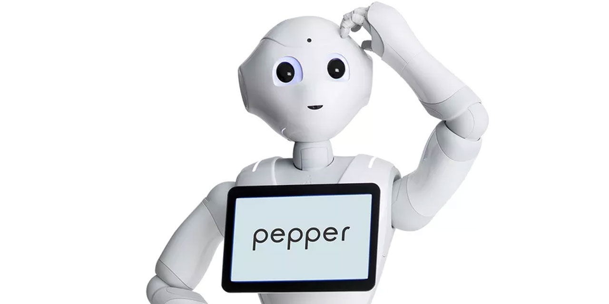

# Human Robot Interaction (HRI) Project



## Table of contents

- [Human Robot Interaction (HRI) Project](#human-robot-interaction-hri-project)
  - [Table of contents](#table-of-contents)
  - [Autors](#autors)
  - [Tree structure](#tree-structure)
  - [Objectives](#objectives)
    - [Scenario 1](#scenario-1)
      - [Description of the ethical case(s) implemented](#description-of-the-ethical-cases-implemented)
    - [Scenario 2](#scenario-2)
      - [Description of the ethical case(s) implemented](#description-of-the-ethical-cases-implemented-1)
  - [Startup Instructions](#startup-instructions)
    - [Prerequisites](#prerequisites)
    - [Launching](#launching)
  - [Instructions for use](#instructions-for-use)
  - [References](#references)

## Autors

- [Theotime PERRICHET](https://github.com/TheoTime01)
- [Arnaud SIBENALER](https://github.com/ArnaudS-CPE)

## Tree structure

```
projet_ihr_sibenaler_perrichet
│   README.md
│
├───ethique
│   │   app.py
│   │   application.py
│   │   simple_en.top
│   │
│   └───html
│       │   index.html
│       │   jquery-1.11.2.min.js
│       │   main.css
│       │
│       ├───images
│       │       Capture.jpg
│       │
│       └───JS
│               resistor.js
│               sample.js
│
└───non_ethique
    │   app.py
    │   application.py
    │   simple_en.top
    │
    └───html
        │   index.html
        │   jquery-1.11.2.min.js
        │   main.css
        │
        ├───images
        │       Capture.jpg
        │
        └───JS
                resistor.js
                sample.js
```


## Objectives

Set up two scenarios:

- One scenario should show ethical behavior, the other should not (ideally, they could also be two variations of the same scenario)
- Use the tablet
- Use the dialogue/qichat module
- Set up a service (in the naoqi sense) and interface it with the dialogue
- Make a link with a webservice on the internet or develop your own webservice.

### [Scenario 1](/ethique/)


_youtube link_=

#### Description of the ethical case(s) implemented


### [Scenario 2](/non_ethique/)


_youtube link_=

#### Description of the ethical case(s) implemented

## Startup Instructions

### Prerequisites

export PYTHONPATH=${PYTHONPATH}:/softwares/INFO/Pepper/pynaoqi-python2.7-2.5.5.5-linux64/lib/python2.7/site-packages

export PATH=$PATH:"/softwares/INFO/Pepper/choregraphe-suite-2.5.5.5-linux64/bin"

check the IP address of the robot in the app.py file

in the app.py file, modify the variable self.topic_name :
    
```
    self.topic_name = self.ALDialog.loadTopic("<chemin du fichier top>/top_fr.top")
```

connect the pepper to the wifi

### Launching

- Turn on the pepper robot
- clone this repo to the internal memory of the pepper robot

- In a terminal, run naoqi

```
naoqi-bin

```

- In another terminal, run the choregraphe application

```
choregraphe-bin

```

- In another terminal, run the python application

```
python application.py

```

- In another terminal, run the main script 
  
  ```
  python app.py
  ```

## Instructions for use

- __be careful not to talk too far from the robot__.  
- __if there is no internet connection, it will be impossible to display the equations in Latex__.
- __if the person does not speak loud enough, the robot may either misunderstand the answers to these questions, or not react or misinterpret the answers.__
- __the words spoken must be clear and distinct otherwise it may not understand them.__


## References

- [Rob’éduc](https://www.ouest-france.fr/pays-de-la-loire/nantes-44000/nantes-le-robot-enseignant-debarque-la-rentree-6203134#:~:text=Ces%20cours%20jouent,pour%20l%E2%80%99instant%20secret.)

- [empathie artificielle](https://www.apivia-prevention.fr/sante/sante-mentale/mon-psy-est-un-robot/#:~:text=Les%20chatbots%20proposent,et%20de%20stress.)

- [interactions humain-robot, une représentation presque théatrale](https://www.cairn.info/revue-l-annee-psychologique-2019-4-page-515.htm#pa14)
